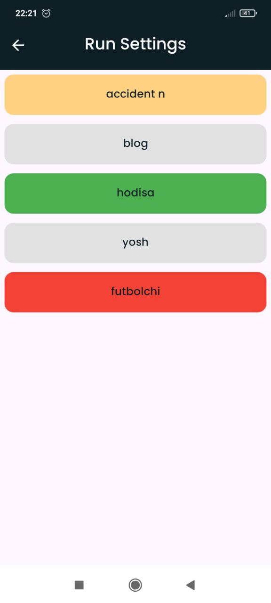

# Dictionary

"Dictionary" is an application for [memorizing vocabulary].

## Features

- **Save Dictionaries** - Saves your dictionaries in local storage
- **Test** - Vocabulary memorization in the form of a test

## Installation

To clone this repository, use the following command:

```bash
git clone https://github.com/ZikrullaYashinov/Dictionary.git
```

# Dictionary

"Dictionary" — bu ilova [lug'at yodlash uchun].

## Xususiyatlar

- **Lug'atlasringizni saqlaydi** - Lug'atlaringizni local xotirada saqlaydi
- **Test** - Test shaklida lug'atlarni yodlash

## O'rnatish

Loyihani klonlab olish uchun quyidagi buyruqdan foydalaning:

```bash
git clone https://github.com/ZikrullaYashinov/Dictionary.git
```
